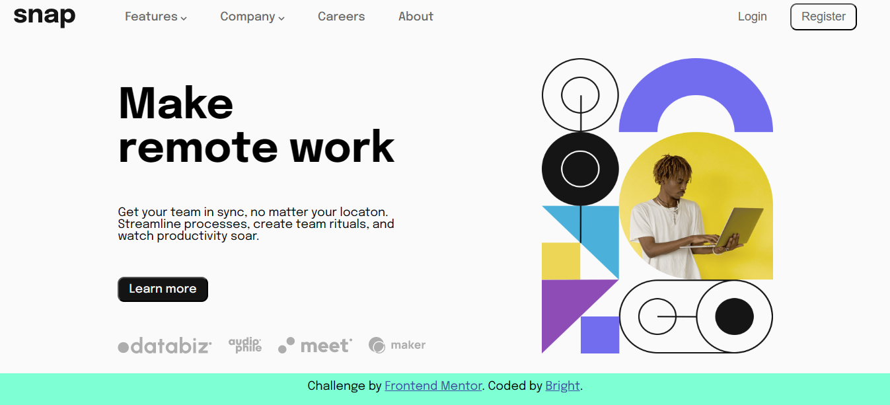

# Frontend Mentor - Intro section with dropdown navigation solution

This is a solution to the
[Intro section with dropdown navigation challenge on Frontend Mentor](https://www.frontendmentor.io/challenges/intro-section-with-dropdown-navigation-ryaPetHE5).
Frontend Mentor challenges help you improve your coding skills by building
realistic projects. Built with HTML, CSS and JavaScript

## Table of contents

-   [Overview](#overview)
    -   [The challenge](#the-challenge)
    -   [Screenshot](#screenshot)
    -   [Links](#links)
-   [My process](#my-process)
    -   [Built with](#built-with)
    -   [What I learned](#what-i-learned)
    -   [Continued development](#continued-development)
-   [Author](#author)
-   [Acknowledgments](#acknowledgments)

## Overview

### The challenge

Users should be able to:

-   View the relevant dropdown menus on desktop and mobile when interacting with
    the navigation links
-   View the optimal layout for the content depending on their device's screen
    size
-   See hover states for all interactive elements on the page

### Screenshot

### Links

-   Solution URL: [github repo](https://github.com/prolixtrex/intro-section)
-   Live Site URL: [netlify](https://bright-intro-section.netlify.app)

## My process

### Built with

-   Semantic HTML5 markup
-   CSS custom properties
-   Flexbox
-   Mobile-first workflow

### What I learned

This challenge enabled me to have more understing of how to create dropdown
menu/lists and a hamburger. Also more knowledge of flexbox, media queries
positioning.

### Continued development

I will like to learn more on dimming the background when the hamburger opens and
closing the hamburger menu when a user clicks outside of it. Right now, I worked
around it but I'm thinking there is a better way to implement them.

## Author

-   Frontend Mentor -
    [Anua Bright](https://www.frontendmentor.io/profile/prolixtrex)
-   Twitter - [Anua Bright](https://www.twitter.com/anua_bright)

## Acknowledgments

I want to acknowledeg frontend mentors for providing this challenge and many
other challenges to enable upcoming developers practice with real-life projects.
